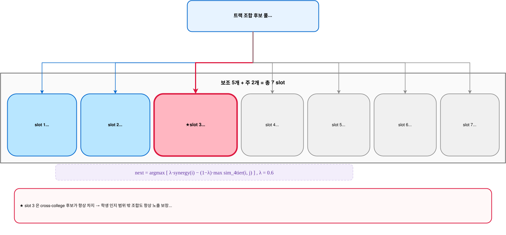

# tracktory-ai


**전공과 직무를 선택하고 싶지만, 아직 무엇을 좋아하고 어떤 길을 가야 할지 모르는 학생들을 위한 AI 학습경로 가이드.**

학생의 관심사·흥미·가치관을 입력받아 적합한 **직무를 발견**하고, 그에 맞는 **트랙 조합을 추천**하며, **학기별 수강 로드맵**까지 자연어로 설명합니다.

이 레포는 단순 LLM 호출 서버가 아니라, FastAPI API 서버이면서 **LangGraph 추천 그래프, 챗봇 그래프, RAGFlow 검색, 역량 커버리지 분석, LLM 설명 생성**까지 담당하는 AI 서비스 레이어입니다.

---

## AI Service Overview

tracktory-ai 는 Spring Boot 백엔드의 내부 호출만 받는 FastAPI 서비스입니다. Spring 이 인증·프로필·이수 과목·추천 결과 저장을 담당하고, tracktory-ai 는 추천 계산과 AI 응답 생성을 담당합니다.

| 영역 | 책임 |
|---|---|
| 추천 API | 온보딩 입력을 LangGraph 추천 그래프에 전달하고 직무·트랙·로드맵·역량 분석·설명을 반환 |
| 챗봇 API | 사용자 컨텍스트와 질문을 받아 의도 분기 기반 챗봇 그래프 실행 |
| 직무 브리핑 API | 직무별 핵심 정보와 학습 방향을 AI 브리핑 형태로 제공 |
| RAGFlow 연동 | 한성대 학사 데이터와 채용공고 기반 지식 베이스 검색 |
| 구조화 출력 | Pydantic 모델로 추천 결과와 LLM 응답 스키마 검증 |

자세한 설계 문서:

- [Recommendation Pipeline Architecture](./docs/architecture/pipeline.md)
- [Track Synergy Design](./docs/design/track-synergy.md)
- [Architecture Decision Records](./docs/adr/README.md)

---

## Recommendation Pipeline



온라인 추천 요청은 LangGraph 7노드 워크플로를 통과합니다.

| Node | 책임 |
|---|---|
| N1 입력 정규화 | 온보딩 입력 검증, 1학년/2학년 이상 분기, 학기 추정 |
| N2 프로필 직렬화 | 관심사·흥미·가치관을 검색에 적합한 `profile_text` 로 변환 |
| N3 직무 매칭 | RAGFlow 검색과 fallback 을 통해 추천 직무 후보 산출 |
| N4 트랙 시너지 | 직무 후보 기준 주 추천 2개와 보조 추천 5개 트랙 조합 생성 |
| N5 학습 로드맵 | 선수과목과 학기 제약을 반영해 수강 흐름 구성 |
| N6 역량 커버리지 | 기준 직무 대비 현재/예상 역량 충족도와 부족 역량 계산 |
| N7 자연어 설명 | RAG 근거를 주입해 추천 이유를 LLM 설명으로 생성 |

## Chatbot Pipeline



챗봇은 추천 그래프와 별도 LangGraph 로 동작합니다. 질문 의도를 먼저 분류하고, 트랙·직무·과목처럼 근거가 필요한 질문은 RAGFlow 검색 경로를 거쳐 답변합니다. 일반 학습 조언은 검색을 건너뛰고 사용자 맥락 기반 응답을 생성합니다.

## Offline Indexing



추천 품질은 온라인 요청 이전의 오프라인 지식 베이스 구축에 의존합니다. 한성대 학사 데이터와 채용공고를 수집·정제하고, RAGFlow/LightRAG 지식 베이스에 과목·트랙·직무 관계를 적재합니다. 온라인 노드는 이 지식 베이스를 검색해 직무 매칭, 트랙 조합, 로드맵, 설명 생성에 사용합니다.

## Track Recommendation Algorithm

### Synergy Score



트랙 조합은 직무 후보군에 대한 보완성, 커버리지, 중복 페널티를 종합해 점수화합니다.

### Slot Reservation



주 추천 2개와 보조 추천 5개를 고정 슬롯으로 구성합니다. 특히 slot 3 은 cross-college 조합을 예약해, 학생이 평소 인지하기 어려운 학과 경계 밖 조합이 결과에 항상 노출되도록 설계합니다.

### 4-tier Diversity



다양성은 단과대, 학부, 트랙, 과목 overlap 의 4단계 거리로 계산합니다. 단순히 점수가 높은 조합만 나열하지 않고, 서로 다른 결의 트랙 조합을 보조 추천에 섞기 위한 기준입니다.

## Roadmap & Coverage

### Reverse Roadmap



로드맵은 과목을 임의로 나열하지 않고, 목표 직무에서 필요한 역량을 역추적한 뒤 해당 역량을 채우는 과목으로 연결합니다. 이미 이수한 과목은 제외하고, 선수과목과 학기 제약을 반영합니다.

### Competency Coverage



역량 커버리지는 “이 직무가 나와 얼마나 맞는가”가 아니라, 기준 직무의 요구 역량 중 현재 이수 과목과 추천 로드맵으로 얼마나 채울 수 있는지를 보여줍니다. 추천 결과가 직무 매칭 점수와 별도로 설명 가능한 학습 계획이 되도록 돕습니다.

---

## 기술 스택

| 기술 | 역할 | 설명 |
|---|---|---|
| **Python 3.13** + **uv** | 런타임 + 패키지 관리 | 빠른 의존성 해결과 재현 가능한 개발 환경 구성 |
| **FastAPI** | 내부 AI API 서버 | Spring Boot 가 인증·트랜잭션을, FastAPI 가 AI 워크로드를 분담 |
| **LangGraph** | 추천·챗봇 워크플로 | 상태 기반 그래프로 다단계 추천 파이프라인을 노드 단위로 분리·테스트 |
| **RAGFlow / LightRAG** | 검색·관계 기반 탐색 | 과목-트랙-직무 관계 그래프와 검색 결과를 추천 근거로 사용 |
| **Pydantic** | 상태·출력 스키마 검증 | 요청/응답과 LLM 구조화 출력의 런타임 타입 안정성 확보 |
| **Ruff** + **mypy** | 린터·포매터 + 타입 체커 | 공개 함수 타입 힌트와 코드 스타일 검증 |

---

## 디렉토리 구조

```
tracktory-ai/
├── src/tracktory/
│   ├── api/                # FastAPI 앱, 라우터, 인증, response envelope
│   ├── briefing/           # AI 직무 브리핑 모델과 서비스
│   ├── chatbot/            # 챗봇 LangGraph, 노드, runner, RAG adapter
│   ├── common/             # 공통 도메인 모델, 카테고리, 기술 키워드
│   ├── config/             # 트랙·과목·직무·시너지 설정 YAML/JSON
│   ├── crawler/            # 채용공고 크롤러와 전처리
│   ├── graph/              # 추천 LangGraph state, pipeline, nodes
│   ├── llm/                # LLM client interface / OpenAI adapter
│   ├── prompts/            # 추천 설명·챗봇 프롬프트 템플릿
│   ├── rag/                # RAGFlow client, course/track/job repository
│   ├── relation/           # 직무-역량, 트랙-역량, 선수과목 관계 구축
│   └── roadmap/            # 로드맵·선수과목 보조 로직
├── docs/
│   ├── adr/                # 아키텍처 결정 기록
│   ├── architecture/       # 추천 파이프라인 구조 문서
│   ├── assets/readme/      # README 다이어그램 SVG
│   └── design/             # 알고리즘 설계 문서
├── scripts/                # 크롤링, 데이터 병합, 운영 보조 스크립트
├── tests/                  # 단위/통합 테스트
├── data/                   # 데이터 (gitignore — 팀 채널로 동기화)
├── pyproject.toml          # 의존성 + ruff/mypy/pytest 설정
├── CONTRIBUTING.md         # 개발 규칙
└── CLAUDE.md               # Claude Code 세션용 프로젝트 컨텍스트
```

---

## 시작하기

### 사전 요구사항

- Python 3.13 이상
- [`uv`](https://github.com/astral-sh/uv) 설치

### 설치 및 실행

```bash
# 1. 클론
git clone https://github.com/Tracktory/tracktory-ai.git
cd tracktory-ai

# 2. 가상환경 + 의존성
uv venv && uv sync

# 3. 환경변수
cp .env.example .env
# .env 파일을 열어 필요한 키 입력 (LLM API 키, RAGFlow 설정 등)
```

```bash
# FastAPI 서버 실행
uv run uvicorn tracktory.api.main:app --reload
```

---

## 개발 루틴

커밋 전에 다음 명령을 실행하세요:

```bash
uv run ruff format .
uv run ruff check . --fix
uv run mypy src
uv run pytest
```

자세한 코드 규약·커밋 규칙은 [`CONTRIBUTING.md`](./CONTRIBUTING.md)를 참조하세요.

---

## Team Roles

| Member | AI Service Role |
|---|---|
| [**이재원**](https://github.com/jwon0523) | Recommendation system design, LangGraph recommendation pipeline, track synergy algorithm, Spring Boot-FastAPI integration |
| [**정종진**](https://github.com/ThreeeJ) | LangGraph chatbot graph, chatbot agent, job-competency mapping, track synergy support |
| [**박성훈**](https://github.com/parkseonghun598) | Data processing support, React Native integration perspective, recommendation result UX validation |
| [**전종현**](https://github.com/J2H3233) | Research, RAGFlow pipeline, embedding/RAG optimization, retrieval quality analysis |

> Crawling, preprocessing, academic/job data cleanup, and initial data loading were handled as shared team work.
