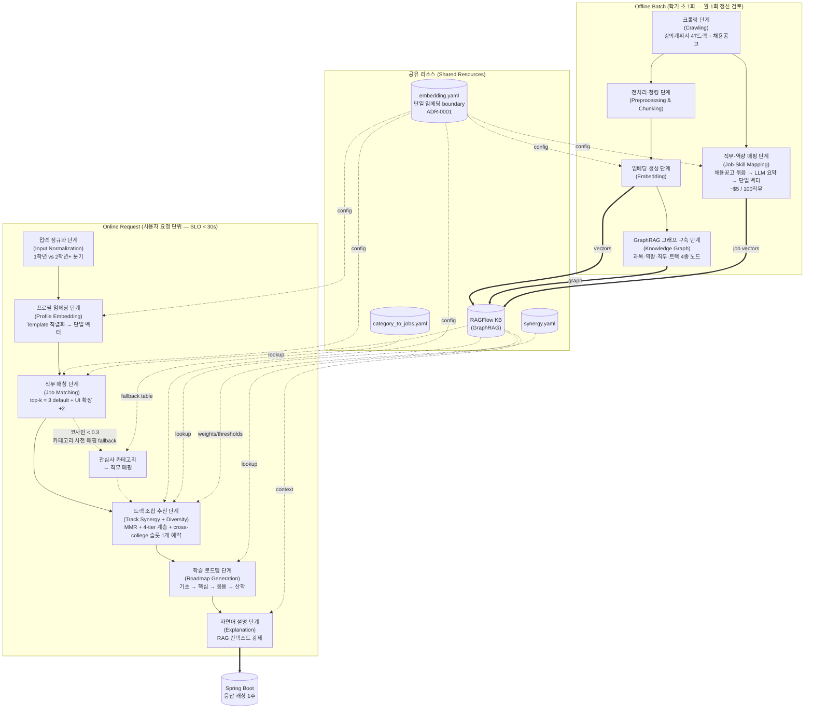

# Recommendation Pipeline Architecture

## Status

Living Document — Stable as of 2026-05-02

> 본 문서는 ADR 만큼 immutable 하지 않으며, 추천 파이프라인의 구조 변경 시 갱신됩니다. 결정 근거(왜 X 가 아닌가) 는 [ADR 디렉토리](../adr/) 로 분리되며, 본 문서는 "현재 어떻게 동작하는가" 의 entry point 역할을 합니다.

---

## 1. Purpose

본 문서는 tracktory-ai 의 추천 파이프라인이 어떻게 구성되어 있는지 한눈에 보여주는 entry point 입니다. 노드 단위 책임·두 축 실행 흐름·공유 리소스·핵심 원칙을 정리하며, 결정 근거(왜 X 가 아닌가) 는 [ADR](../adr/) 로 분리됩니다. 트랙 조합 추천 단계의 인터페이스·알고리즘 합의는 [Track Synergy Design Doc](../design/n4-track-synergy.md) 에 별도 정리되어 있습니다.

**문서 역할 분리**

| 문서 | 역할 |
|---|---|
| **본 문서** (`docs/architecture/`) | 파이프라인 entry point — 현재 어떻게 동작하는가 |
| **ADR** (`docs/adr/`) | 결정의 영구 기록 — 왜 X 가 아닌가 |
| **Design Doc** (`docs/design/`) | 노드 단위 인터페이스·알고리즘 합의 (구현 전) |
| [`CLAUDE.md`](../../CLAUDE.md) | 아키텍처 철학 (5개 원칙) |
| [`CONTRIBUTING.md`](../../CONTRIBUTING.md) | 코딩 규약 (LangGraph state / 노드 / 엣지 / 테스트) |

---

## 2. System Context

추천 파이프라인은 3-tier 구조의 가장 안쪽 레이어에서 동작합니다.

```
React Native 앱
   ↓ REST
Spring Boot 메인 백엔드  ── 사용자 인증·트랜잭션·DB 캐싱
   ↓ REST (내부 호출)
FastAPI AI 중계 서버     ── LangGraph 추천 파이프라인 + RAGFlow / LLM 호출 격리
```

본 파이프라인은 FastAPI 안에서 LangGraph 로 실행되며, 외부 의존성(LLM·RAGFlow) 의 호출은 모두 FastAPI 레이어에 격리됩니다. Spring Boot 는 응답을 1주 단위로 캐싱하여 반복 호출 시 LLM 비용을 차단합니다.

대상 도메인은 한성대 트랙제입니다. 한성대는 47개 트랙 중 2개를 선택하는 트랙제 (이론상 1,081개 조합) 를 운영하며, 본 파이프라인은 이 조합 공간에서 학생의 관심사·직무에 적합한 트랙 조합·학습 로드맵을 산출하는 것이 핵심 역할입니다.

---

## 3. Two-Axis Structure

추천 파이프라인은 **Offline 배치** 와 **Online 요청** 두 축으로 분리됩니다.

### 3.1 다이어그램



**범례**

- 실선 (`==>`) = 데이터 흐름 (vector / graph / 사용자 응답)
- 점선 (`-.->`) = 설정 lookup / RAG lookup / fallback 경로

**Fallback 동작**: 직무 매칭 단계에서 코사인 유사도가 임계값(0.3) 미만이면 정상 출력 대신 카테고리 사전 매핑 결과가 트랙 조합 추천 단계의 입력으로 대체됩니다. 두 경로가 동시에 활성화되지 않으며, 한쪽만 다음 단계로 흘러갑니다.

### 3.2 왜 두 축인가

단일 축으로 묶으면 batch 와 realtime 의 SLO·캐싱 전략이 분리되지 않습니다. Offline 은 학기 단위 배치로 시간 여유가 있는 대신 47개 트랙 전체를 처리해야 하고, Online 은 사용자 요청 단위로 30초 이내 응답이 필요합니다. 두 축으로 분리하면 갱신 주기·실패 처리·캐싱 정책이 각자 최적화됩니다. Offline 은 RAGFlow 적재 실패 시 재시도가 가능하지만 Online 은 사용자 대기 시간 안에 결과를 돌려줘야 하므로 fallback 경로가 명시적으로 필요합니다.

---

## 4. Node Responsibilities

### 4.1 Offline Batch

| 단계 | 1줄 책임 |
|---|---|
| 크롤링 (Crawling) | 한성대 강의계획서 47트랙 전체 + 원티드 채용공고 수집 |
| 전처리·청킹 (Preprocessing & Chunking) | 수집 텍스트를 200자 단위 청크로 분할, 메타데이터 정제 |
| 임베딩 생성 (Embedding) | 청크 / 트랙 메타 텍스트를 단일 임베딩 모델로 벡터화 |
| GraphRAG 그래프 구축 (Knowledge Graph) | 과목·역량·직무·트랙 4종 노드를 관계 엣지로 연결 |
| 직무-역량 매핑 (Job-Skill Mapping) | 채용공고 묶음을 LLM 으로 요약 후 직무당 단일 벡터 + 기술스택 top-10 산출 |

### 4.2 Online Request

| 단계 | 1줄 책임 |
|---|---|
| 입력 정규화 (Input Normalization) | 온보딩 입력을 백엔드 스키마로 매핑, 1학년 / 2학년 이상 분기 |
| 프로필 임베딩 (Profile Embedding) | 관심사·흥미·가치를 자연어 Template 으로 직렬화한 후 단일 벡터로 임베딩 |
| 직무 매칭 (Job Matching) | 프로필 벡터와 직무 벡터의 코사인 유사도로 top-k 직무 후보 추출 (k=3 default + UI 확장 시 +2) |
| 트랙 조합 추천 (Track Synergy + Diversity) | 시너지 점수 + MMR 다양성 + cross-college 슬롯 1개 예약으로 주 추천 2 + 보조 추천 5 산출 |
| 학습 로드맵 (Roadmap Generation) | 추천 트랙 조합을 기초 → 핵심 → 응용 → 산학 4단계 학기별 수강 가이드로 변환 (선수과목 위배 0) |
| 자연어 설명 (Explanation) | 추천 결과에 대해 RAGFlow 검색 결과를 컨텍스트로 강제 주입한 LLM 설명 생성 |

---

## 5. Shared Resources

### 5.1 단일 임베딩 boundary

다섯 위치(Offline 임베딩 생성 / GraphRAG 구축 / 프로필 임베딩 / 직무 매칭 / 트랙 메타 다양성 측정) 가 단일 `embedding.yaml` 설정을 공유합니다. 자세한 사유와 결정 배경은 [ADR-0001 Single Embedding Boundary](../adr/0001-single-embedding-boundary.md) 참조.

### 5.2 RAGFlow Knowledge Base

GraphRAG 기반 관계 그래프 + 벡터 인덱스. Offline 배치가 적재하고 Online 노드들이 lookup 합니다. 직무-과목, 과목-역량, 트랙-직무 등 단순 벡터 유사도로는 표현 불가능한 관계를 그래프 쿼리로 처리합니다. 학생이 "AI에 관심" 이라고 입력했을 때 단순 키워드 매칭이 아니라 "AI 관련 직무 → 필요 역량 → 그 역량을 가르치는 과목" 의 관계 경로를 따라가는 것이 GraphRAG 의 핵심 가치입니다.

### 5.3 외부 설정 파일

| 파일 | 역할 |
|---|---|
| `embedding.yaml` | 임베딩 모델 식별자·차원·정규화 정책 (ADR-0001) |
| `synergy.yaml` | 트랙 시너지 식 가중치 / sim 항 가중치 / MMR `λ` / cross-college 슬롯 임계값 |
| `category_to_jobs.yaml` | 14개 관심사 카테고리 × top-5 직무 매핑 (직무 매칭 fallback 용) |

가중치·임계값을 코드 상수가 아닌 yaml 로 외부화한 이유는 두 가지입니다. 첫째, ablation 실험 시 코드 수정 없이 가중치 변경이 가능합니다. 둘째, 운영 중 임계값 튜닝이 deploy 와 분리됩니다.

---

## 6. Core Principles

1. **단일 임베딩 boundary** — 다섯 위치의 코사인 유사도 비교가 항상 동일한 임베딩 공간에서 이루어지도록 강제합니다 (ADR-0001).
2. **부작용 격리** — LLM 호출·RAGFlow 질의·외부 I/O 는 전용 노드에만 집중합니다. 순수 계산 노드와 I/O 노드를 분리하여 테스트에서 mock 없이 검증 가능하도록 유지합니다.
3. **단일 책임 노드** — 한 노드는 하나의 논리 변환만 담당합니다. 분류와 검색, 검색과 생성을 한 노드에 섞지 않습니다.
4. **외부화 가능한 임계값·가중치** — yaml 외부화로 ablation·운영 튜닝을 코드 변경과 분리합니다 (§5.3).
5. **다양성 강제는 트랙 조합 추천 단계에서만** — 직무 매칭과 학습 로드맵은 정확도 우선, 다양성(MMR — 관련성과 다양성 균형 reranking 알고리즘, Carbonell & Goldstein 1998) 은 트랙 조합 단계에서만 적용합니다. 직무·과목 단계에 다양성을 강제하면 사용자 의도와 어긋난 추천이 만들어지기 쉽습니다.

---

## 7. Operational Constraints

| 항목 | 값 / 정책 |
|---|---|
| Offline 갱신 주기 | 학기 초 1회 (월 1회 갱신 검토) |
| Online 응답 SLO | 30초 미만 |
| 응답 캐싱 | Spring Boot DB 1주 단위 |
| 직무 매칭 top-k | default 3, UI "더 보기" 클릭 시 +2 (총 5) |
| 직무 임베딩 unit | 채용공고 묶음 → LLM 요약 → 직무당 단일 벡터. 학기 1회 배치 (~$5 / 100직무) |
| 직무 매칭 fallback 임계값 | 코사인 < 0.3 시 카테고리 사전 매핑(`category_to_jobs.yaml`) 으로 대체 |
| 다양성 알고리즘 | MMR + 4-tier 계층 (단과대 → 학부 → 트랙 → 과목 overlap) + cross-college 슬롯 1개 예약 |
| 학습 로드맵 4단계 | 기초 → 핵심 → 응용 → 산학. 선수과목 제약 위배 0 강제 |
| 데이터 소스 | 한성대 강의계획서 47트랙 (전체) + 원티드 채용공고 |

---

## 8. Subsequent ADR Candidates

본 문서가 다루지 않는 안정화 대기 결정은 [ADR README](../adr/README.md) 의 "후속 ADR 후보" 섹션에서 추적합니다. 1+ 스프린트 변경 없이 통과하면 ADR 로 승격을 검토합니다.

- 트랙 시너지 알고리즘 — Slot Reservation Pattern (Hard Constraint + MMR)
- 4-tier hierarchy 정의 (T1 단과대 / T2 학부 / T3 트랙 / T4 과목 overlap)
- MMR 다양성 알고리즘 (lambda 초기값 + ablation 결과)
- 한국어 임베딩 모델 채택 (BGE-M3 등 — 현재 ADR-0001 scope creep 방지로 분리)

---

## 9. References

### 내부 (팀 공유 자산)

- [ADR-0001 Single Embedding Boundary](../adr/0001-single-embedding-boundary.md) — 단일 임베딩 boundary 결정 근거
- [Track Synergy Design Doc](../design/n4-track-synergy.md) — 트랙 조합 추천 단계 인터페이스·알고리즘
- [`CLAUDE.md`](../../CLAUDE.md) — 아키텍처 철학 5개 원칙
- [`CONTRIBUTING.md`](../../CONTRIBUTING.md) — LangGraph 코딩 규약

### 외부 공개 자료

- LangGraph Documentation — https://langchain-ai.github.io/langgraph/
- RAGFlow Documentation — https://ragflow.io/docs
- Carbonell & Goldstein, "The Use of MMR, Diversity-Based Reranking for Reordering Documents and Producing Summaries" (1998) — MMR 다양성 알고리즘 원논문
- Microsoft Research, "GraphRAG: Unlocking LLM discovery on narrative private data" (2024)

---

## 변경 이력

| 버전 | 일자 | 작성자 | 변경 내용 |
|---|---|---|---|
| 0.1 | 2026-05-02 | 이재원 | 초안. 두 축 구조 mermaid + 노드별 1줄 책임 + 공유 리소스 + 핵심 원칙 5개 + 운영 제약 + 후속 ADR 후보 인덱스. |
